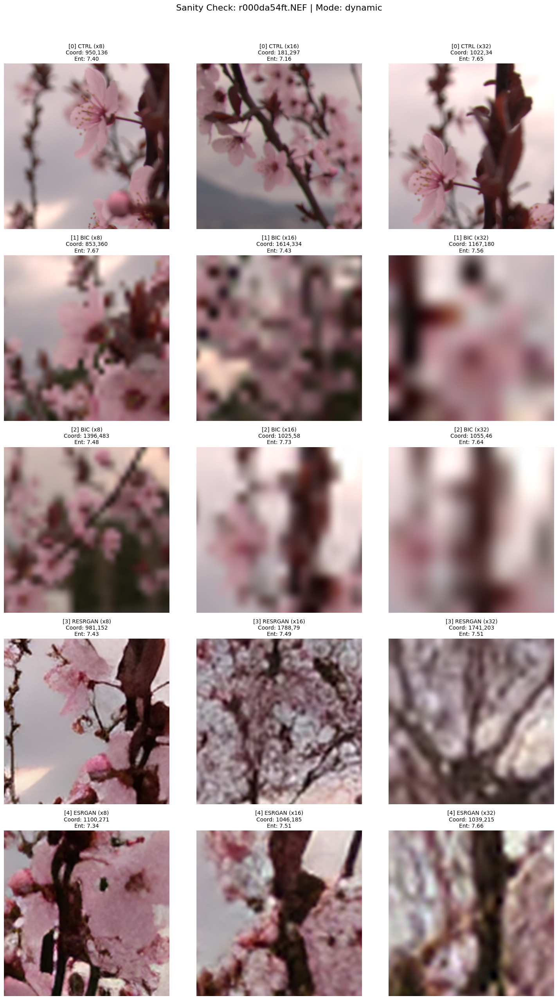

<style>
section {
  font-size: 29px;
}
section.compact {
  font-size: 22px;
  padding: 46px 64px;
}
section.compact h1 {
  font-size: 38px;
  margin-bottom: 12px;
}
section.compact h2 {
  font-size: 24px;
  margin: 0 0 8px;
}
section.code-slide {
  padding: 46px 64px;
}
section.code-slide h1 {
  font-size: 38px;
  margin-bottom: 12px;
}
section.code-slide pre {
  font-size: 0.56em;
}
section.compact ul {
  margin-top: 6px;
}
section.compact li {
  margin: 4px 0;
}
.cols {
  display: grid;
  grid-template-columns: 1fr 1fr;
  gap: 28px;
}
.note {
  border-left: 5px solid #4f46e5;
  font-size: 20px;
  margin-top: 12px;
  padding-left: 14px;
}
.mapping {
  display: grid;
  grid-template-columns: repeat(4, 1fr);
  gap: 10px;
  margin-top: 14px;
}
.mapping div {
  border: 1px solid #d8dee9;
  border-radius: 6px;
  padding: 9px 10px;
}
.mapping b {
  display: block;
  font-size: 24px;
}
.mapping span {
  display: block;
  font-size: 18px;
  margin-top: 4px;
}
table {
  font-size: 0.86em;
}
pre {
  font-size: 0.72em;
}
</style>

<!--
_class: lead
-->

# Downscale-State CNN

## Klasyfikacja stanu downscalingu obrazów

Dataset RAISE · pipeline próbek 256x256 · klasy `CTRL`, `x8`, `x16`, `x32`

---

# Cel projektu

Zbudować lekki model CNN, który na podstawie samego obrazu `256x256` rozpoznaje, do jakiego stanu obraz został wcześniej zdownscalingowany.

**Pytanie badawcze:** czy po finalnym obrazie można rozpoznać ślad wcześniejszego zmniejszenia skali?

| Stan | Znaczenie | Klasa |
|---|---|---:|
| `CTRL` | obraz kontrolny, bez degradacji | 0 |
| `x8` | downscale z czynnikiem 2 | 1 |
| `x16` | downscale z czynnikiem 4 | 2 |
| `x32` | downscale z czynnikiem 8 | 3 |

---

<!--
_class: compact
-->

# Kontekst naukowy

Inspiracja: **Blind Image Quality Assessment Using Convolutional Neural Networks**  
M. Frackiewicz, H. Palus, W. Trojanowski, Politechnika Śląska.

CNN jako praktyczne rozwiązanie rozpoznawania jakości obrazów

<div class="cols">
<div>

**Co bierzemy z pracy**

- architektura modelu,
- uczenie na patchach,
- Adam jako optymalizator.

</div>
<div>

**Co zmieniamy**

- zamiast oceny jakości: klasyfikacja,
- zamiast benchmarków TID2013/KADID-10k: próbki z RAISE,

</div>
</div>

---

# Dataset RAISE

RAISE jest bazą naturalnych fotografii w formacie RAW/NEF.

W projekcie pełni rolę źródła obrazów naturalnych, z których generowane są kontrolowane próbki degradacji.

Założenia:

- jedno zdjęcie źródłowe nie może przeciekać między splitami,
- najpierw ustalany jest split źródła,
- dopiero potem generowane są warianty próbek dla tego źródła.

---

# Aktualny status

Pipeline generowania danych działa end-to-end.

Obecny przebieg roboczy:

- przetworzono około `1000` obrazów źródłowych,
- utworzono `15000` próbek PNG,
- zapisano `manifest.jsonl`, `splits.json` i `pipeline_config.json`,
- dane są gotowe do dalszego treningu klasyfikatora.

Główne ograniczenie na dziś: czas przetwarzania i dostęp do GPU.

---

# Skala danych

Aktualna konfiguracja:

- `5` par degradacji,
- `3` skale: `8`, `16`, `32`,
- `5 x 3 = 15` próbek z jednego obrazu źródłowego.

Dlatego:

```text
1000 obrazów źródłowych x 15 próbek = 15000 próbek
```

---

# Pipeline



Przepływ operacyjny:

1. Google Drive trzyma wejściowe RAW/NEF.
2. Colab kopiuje batch do lokalnego `/content`.
3. Pipeline generuje PNG 256x256 i manifest.
4. Wyniki są pakowane do ZIP.
5. ZIP wraca na Drive.
6. Dalszy trening powinien przejść na mocniejszy serwer z GPU.

---

# Smart Crop

Smart crop wybiera fragment obrazu, który ma wystarczająco dużo informacji dla klasyfikatora.

Mechanizm:

- losowanie `16` kandydatów,
- ocena entropią Shannona,
- filtr wariancji Laplaciana,
- fallback do centrum, jeśli żaden kandydat nie spełni progów.

Cel praktyczny: unikać płaskich fragmentów, które nie niosą widocznego śladu degradacji.

---

# Warianty danych

Każdy obraz źródłowy przechodzi przez pięć par wariantów dla trzech skal `x8`, `x16`, `x32`.

| Pair | Downscale | Upscale | Rola |
|---:|---|---|---|
| 0 | `CTRL` | `CTRL` | kontrola |
| 1 | `NN` | `BIC` | aliasing / geometria |
| 2 | `BOX` | `BIC` | rozmycie |
| 3 | `BIC` | `Real-ESRGAN` | rekonstrukcja AI |
| 4 | `LANCZOS` | `ESRGAN classic` | wygląd vs wierność |

Etykieta klasy zależy od stanu/skali, nie od pary degradacji.

---

# Manifest
`manifest.jsonl` służy do odtworzenia:

- pochodzenia próbki,
- splitu,
- pary degradacji,
- skali downscalingu,
- lokalizacji pliku PNG,
- etykiety klasy dla modelu.
</div></div>

---

<!--
_class: code-slide
-->

# Rekord manifestu

```json
{
  "sample_id": "..._p3_s16",
  "source_image_id": "...",
  "source_file": "r000da54ft.NEF",
  "split": "train",
  "is_stress_test": false,
  "pair_id": 3,
  "degradation": {
    "downscale": {"name": "Bicubic", "abbr": "BIC"},
    "upscale": {"name": "Real-ESRGAN", "abbr": "RESRGAN"},
    "scale_factor": 16
  },
  "crop": {
    "size_px": 256,
    "top_left_xy": [1788, 79],
    "fallback_used": false
  },
  "file": {
    "path_relative": "train/...png",
    "format": "PNG"
  }
}
```

---

<!--
_class: compact
-->

# Model CNN

<div class="cols">
<div>

## Adaptacja idei BIQA

- wejście: PNG `256x256x3`,
- lokalna normalizacja `3x3`,
- `tf.data` ładuje obrazy batchami,

Główna zmiana: głowica nie przewiduje jakości obrazu, tylko stan downscalingu.

</div>
<div>

## Architektura

- bloki `Conv2D -> BatchNorm -> MaxPool`,
- filtry: `32, 64, 128, 256, 256, 256`,
- warstwa gęsta strojona przez Optunę,
- `Dropout` i Adam,
- `Dense(4, softmax)`.

</div>
</div>

<div class="mapping">
<div><b>0</b><code>CTRL</code><span>brak degradacji</span></div>
<div><b>1</b><code>scale=8</code><span>downscale x8</span></div>
<div><b>2</b><code>scale=16</code><span>downscale x16</span></div>
<div><b>3</b><code>scale=32</code><span>downscale x32</span></div>
</div>

---

# Ograniczenia obliczeniowe

Colab Free okazał się niewystarczający już na etapie strojenia hiperparametrów.

Problemy:

- wolne generowanie danych dla większych batchy,
- kosztowne modele ESRGAN,
- limit czasu sesji,

Wniosek: pełne przetwarzanie RAISE i docelowy trening wymagają mocniejszego serwera z GPU.

---

# Następne kroki

1. Dokończyć przetwarzanie pełnego datasetu RAISE.
2. Uruchomić trening klasyfikatora na serwerze z GPU.
3. Ocenić accuracy globalnie oraz per `scale_factor`.
4. Sprawdzić, które pary degradacji najłatwiej lub najtrudniej ukrywają ślad downscalingu.
5. Przygotować końcową ewaluację na `stress_test`.
